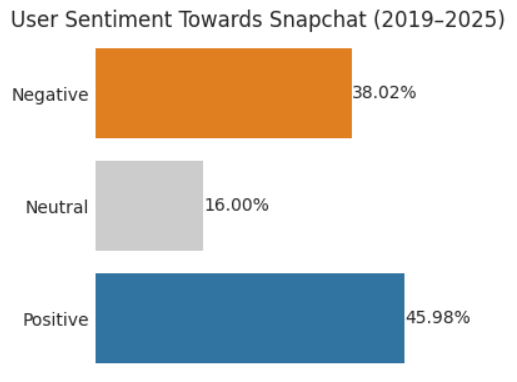
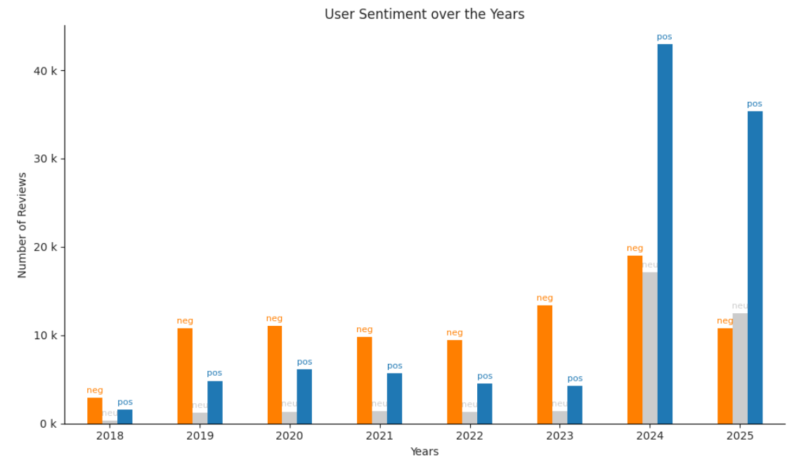
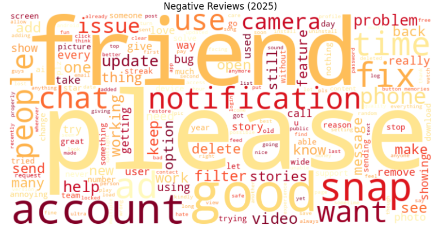
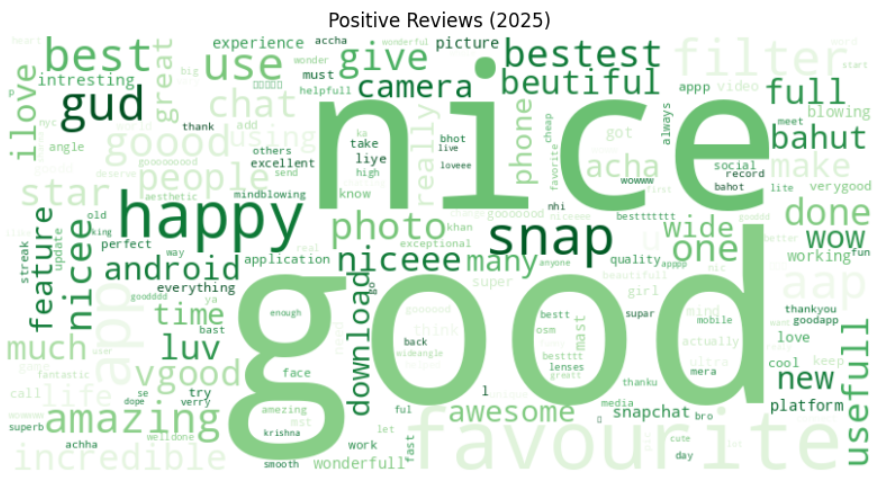

# 🧾 Sentiment Analysis of Snapchat user reviews (2018-2025)

_An in-depth sentiment analysis of over 228,000 Snapchat user reviews from 2018 to 2025 using NLP techniques in python._

---

## 📌 Table of Contents
- <a href="#project-overview">Project Overview</a>
- <a href="#executive-summary">Executive Summary</a>
- <a href="#key-findings">Key Findings</a>
- <a href="#sataset">Dataset</a>
- <a href="#technologies-used">Technologies Used</a>
- <a href="#setup-and-installation">Setup and Installation</a>
- <a href="#methodology">Methodology</a>
- <a href="#visualizations">Visualizations</a>
- <a href="#contributing">Contributing</a>
- <a href="#author--contact">Author & Contact</a>

---
<h2><a class="anchor" id="project-overview"></a>Project Overview</h2>

This project performs a comprehensive sentiment analysis of user reviews for the Snapchat mobile application. The analysis is divided into two main stages:
- Cleaning the raw review data and adding sentiment scores using a pre-trained RoBERTa model to prepare it for analysis.
- Analyzing the cleaned data to realise sentiment trends and uncovering key themes in user feedback using wordcloud and topic modelling.

---
<h2><a class="anchor" id="executive-summary"></a>📊 Executive Summary</h2>

This project analyzes over 228,000 Snapchat reviews (2018–2025) to uncover sentiment trends and key user pain points. Results reveal a polarized user base: 46% of reviews are positive, praising filters, camera features, and social connectivity, while 38% are negative, citing bugs, intrusive ads, and account or privacy issues. Updates in 2024–2025 boosted satisfaction, but persistent technical flaws and confusing features continue to frustrate many users. Overall, Snapchat’s success depends on fixing core issues and enhancing trust while building on its strengths in creativity and social engagement.

---
<h2><a class="anchor" id="key-findings"></a>Key Findings</h2>

- **Polarized Sentiment:** 46% of reviews are positive, 38% negative, and 16% neutral, showing a divided user base.  
- **Ratings Distribution:** 43% of users gave 5-star ratings, but 1-star ratings remain consistently high.  
- **Recent Shift (2024–2025):** Positive sentiment surged after updates, though negative feedback persisted.  
- **Recurring Issues:** Technical problems, intrusive ads, and account/privacy concerns are the main drivers of dissatisfaction.  
- **User Priorities:** Stability, trust, and performance remain more important to users than frequent new features.  

---
<h2><a class="anchor" id="dataset"></a>Dataset</h2>

The dataset used in this project is a collection of user reviews of the Snapchat app, sourced from a CSV file (`snapchat_reviews.csv`). The initial dataset contains **231,984 reviews**.

After data cleaning (handling missing values in content column and removing **3,053 duplicates**), the final dataset used for analysis consists of **228,928 unique reviews**.

---
<h2><a class="anchor" id="technologies-used"></a>Technologies Used</h2>

- Python 3.11
- Pandas & NumPy for data manipulation
- Matplotlib & Seaborn for data visualization
- NLTK & Scikit-learn for text processing
- Transformers (Hugging Face) for the RoBERTa model
- VADER for sentiment analysis
- Bertopic and sentence_transformers for topic modelling

---
<h2><a class="anchor" id="setup-and-installation"></a>Setup and Installation</h2>

To run this project locally, follow these steps:

- **Clone the repository:**
   ```bash
   git clone [https://github.com/raju713343/snapchat-sentiment-analysis.git](https://github.com/raju713343/snapchat-sentiment-analysis.git
   cd snapchat-sentiment-analysis
   ```

- **Create a virtual environment (recommended):**
   ```bash
   python -m venv venv
   source venv/bin/activate  # On Windows, use `venv\Scripts\activate`
   ```

- **Install the required dependencies:**
   ```bash
   pip install -r requirements.txt
   ```
---
<h2><a class="anchor" id="methodology"></a>Methodology</h2>

The analysis was conducted in the following steps:
- **Data Loading and Cleaning:** The dataset was loaded and preprocessed to handle missing values and prepare the text for analysis.
- **Sentiment Analysis:** A pre-trained RoBERTa model was used to assign sentiment scores (positive, negative, neutral) to each review.
- **Exploratory Data Analysis (EDA):** The sentiment scores and ratings were analyzed to identify trends and distributions.
- **Word Cloud Generation:** Word clouds were created to visualize the most frequent terms in positive, negative and neutral reviews.
- **Topic Modeling:** Latent Dirichlet Allocation (LDA) with Count Vectorizer was applied to identify the main topics of discussion in the reviews. Additionally, BERTopic using SentenceTransformers embeddings was employed to extract more nuanced and context-aware topics.

---
<h2><a class="anchor" id="project-structure"></a>Project Structure</h2>

```
snapchat-sentiment-analysis/
├── .gitignore
│   
├── deliverables/
│   └── Snapchat_analysis_report.pdf
│
├── images/ 
│
├── notebooks/
│   ├── snapchat_data_wrangling.ipynb
│   └── snapchat_sentiment_analysis.ipynb
│
├── README.md   
└── requirements.txt
```

---
<h2><a class="anchor" id="visualizations"></a>Visualizations</h2>

**Overall User Sentiment**


**User Sentiment Over Time**


**Negative Sentiment WordCloud for 2025**


**Positive Sentiment WordCloud for 2025**


---
<h2><a class="anchor" id="contributing"></a>Contributing</h2>

Contributions are welcome! If you have any suggestions or find any bugs, please open an issue or submit a pull request.

---
<h2><a class="anchor" id="author--contact"></a>Author & Contact</h2>

**Raju Chouhan**  
Data Analyst  
📧 Email: rajuchouhan2012@gmail.com  
🔗 [LinkedIn](https://www.linkedin.com/in/raju-chouhan-9b20091a1/)  
🔗 [GitHub](https://github.com/raju713343/vendor-performance-analysis-python-sql-powerbi)"# snapchat-sentiment-analysis" 
